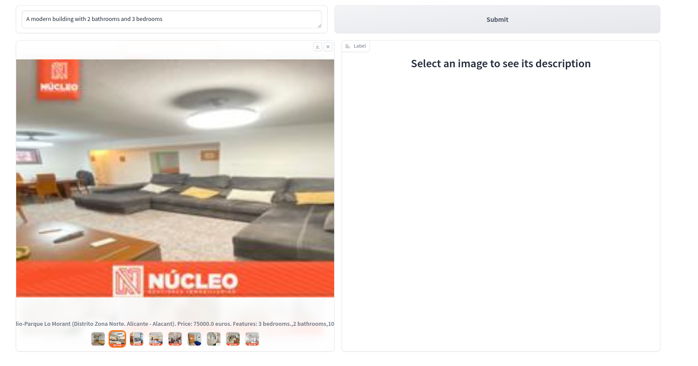

# Homematach

Welcome to Homematach, a simple tool designed to scrape real estate data and streamline the process of data collection and analysis. Follow the steps below to install, configure, and utilize Homematach effectively.


## Installation

Ensure you have Poetry installed on your machine to manage dependencies and environments. To install Homematach, use the following command:

```bash
poetry install
```

This command will install all necessary dependencies, setting up your environment for Homematach to run smoothly.

## How to use

To successfully use Homematach, follow these step-by-step instructions:

### 1. Select a URl

Choose a URL from fotocasa.com that you wish to scrape. For instance, you can use the following URL for properties in Alicante:

https://www.pisos.com/viviendas/alicante_alacant/

### 2. Configure the Scraper

Update the SCRAPER_URLS variable in the configuration file to include the URL(s) you want to scrape. Here's how to modify it:

```python
SCRAPER_URLS=[https://www.pisos.com/viviendas/alicante_alacant/]
```

### 3. Execute the Scraper

Initiate the scraping process using the following command:

```bash
make crawl_landing_pisos
```

A new json file will be created located in data/crawler_data

This command triggers the scraper, which collects data from the specified URL and saves it in a JSON file located at data/crawler_data.

### 4. Prepare the Data

Once the scraping is complete, prepare the dataset by running:

```bash
python scripts/prepare_data.py
```

This script transforms the raw data into a structured format suitable for analysis and storage.

### 5. Populate the Database

Load the processed data into the Lance vector database by executing:

```python
python scripts/populate_database.py
```

### 6. Launch the Application

With the data successfully loaded, run the application to start querying and analyzing your collected data.


